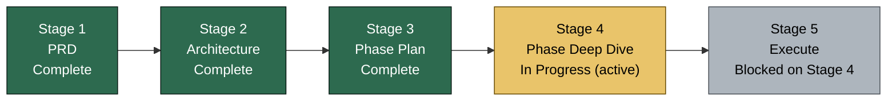
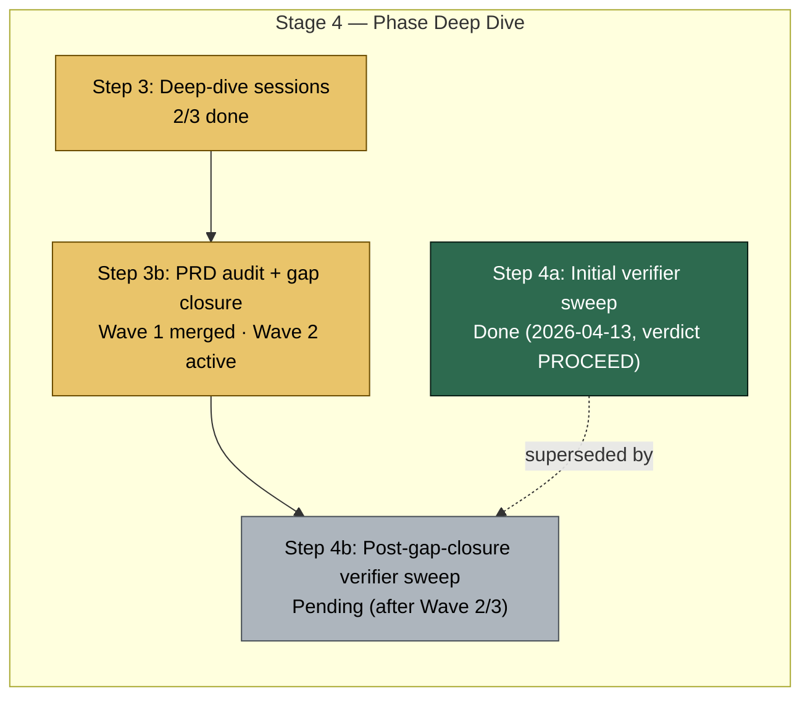
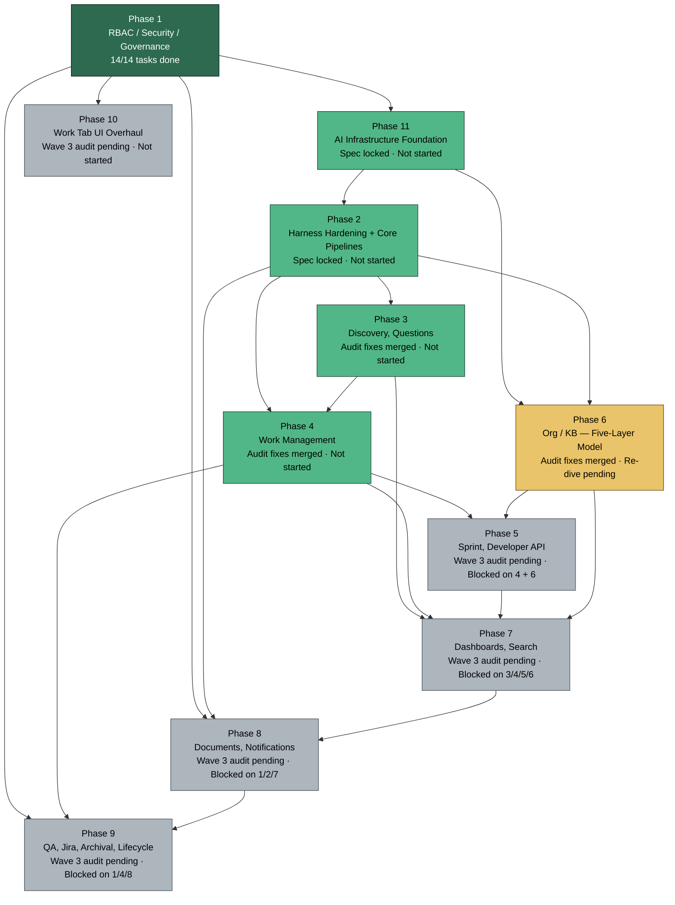
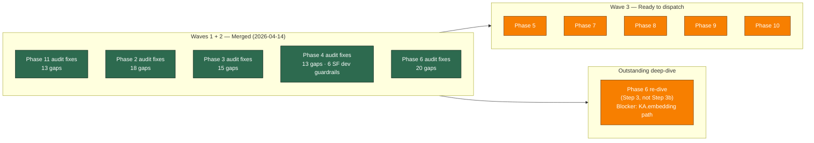

# Project State — Visual Companion

> Hand-maintained mirror of `PROJECT_STATE.md`. If anything here disagrees with `PROJECT_STATE.md`, that file wins. Update this file whenever phase status, current step, or next actions change.
>
> **Last synced:** 2026-04-14 — Waves 1 + 2 merged (Phases 11, 2, 3, 4, 6 audit fixes). Wave 3 (Phase 5, 7, 8, 9, 10) ready to dispatch. Phase 6 re-dive still pending (Step 3 deep-dive, separate from Step 3b audit).

---

## 1. Where we are in the overall pipeline

### Stage 4 breakdown (active stage)

**Active step:** Step 3 (Phase 6 re-dive, next) + Step 3b (Wave 2 audit fixes, ready to dispatch). Phase 1 previously executed in Stage 5 before the Addendum replan; no other Stage 5 work is active.

---

## 2. Phase dependency graph and status

**Legend:**
- Done — tasks executed and merged
- Spec locked / audit fixes merged — ready to execute pending final verifier sweep
- Re-dive pending — Phase 6 still needs Step 3 deep-dive (separate from Step 3b audit)
- Wave 3 audit pending — gap-closure fixes not yet dispatched
- Blocked — waiting on upstream phase

---

## 3. Current focus — Wave 3 gap-closure

---

## 4. What's next (granular)

Mirrored from `PROJECT_STATE.md` → "What's next, in order". Update both files together.

1. **Phase 6 re-dive** (Five-Layer Org KB) — Step 3 deep-dive (distinct from the Wave 2 audit fix already merged)
   - Blocker to resolve first: `KnowledgeArticle.embedding` migration path
   - Depends on: Phase 11 (done), Phase 2 (done)
2. **Wave 3 audit fixes** — dispatch fix agents for Phases 5, 7, 8, 9, 10
3. After Wave 3 merges → Step 4b: post-gap-closure verifier sweep
4. After verifier PROCEED → Stage 5 execute (wave-based)

### Quick fixes (do anytime, ~5 min each)

- None currently. (See `PROJECT_STATE.md` → "Quick fixes" if this list drifts.)

### User decisions pending

- See `docs/bef/audits/2026-04-13/CROSS_PHASE_SUMMARY.md` → Wave 0 user-decision queue.

---

## 5. Bug tracker snapshot

| Metric | Value |
|---|---|
| Total bugs | 0 |
| Open | 0 |
| Active bug phase | None |

Full detail: `docs/bef/04-bugs/BUGS.md`.

---

## How to keep this file in sync

When you edit `PROJECT_STATE.md`, update these in this file:
1. **Last synced** date at the top.
2. Pipeline stage status (Section 1) if the active stage moved.
3. Phase graph classes (Section 2) if any phase status changed — edit the `:::class` suffix on the node.
4. Current focus (Section 3) if the active wave shifted.
5. "What's next" list (Section 4) to match `PROJECT_STATE.md`.
