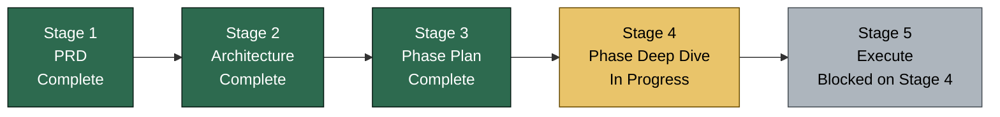
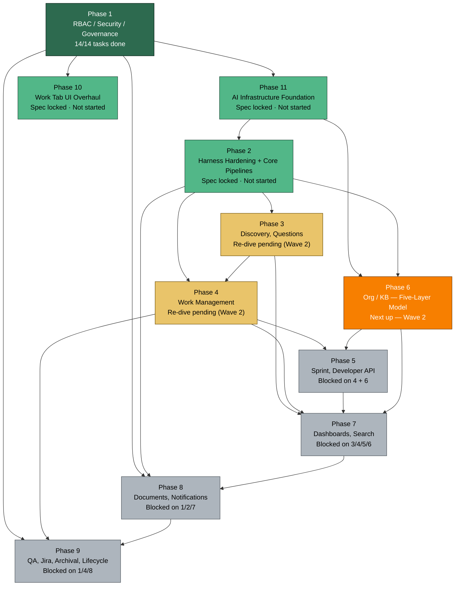
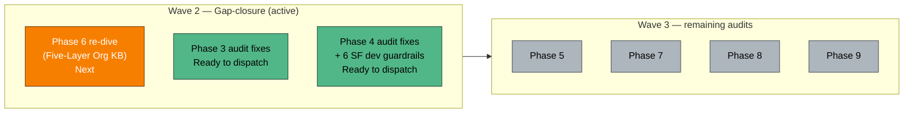

# Project State — Visual Companion

> Hand-maintained mirror of `PROJECT_STATE.md`. If anything here disagrees with `PROJECT_STATE.md`, that file wins. Update this file whenever phase status, current step, or next actions change.
>
> **Last synced:** 2026-04-14 — Wave 1 merged, Wave 2 (Phase 6, 3, 4) ready to dispatch.

---

## 1. Where we are in the overall pipeline

**Active step:** Step 3 — Gap-closure pass (Wave 2: Phase 6, 3, 4).

---

## 2. Phase dependency graph and status

**Legend:**
- Done — tasks executed and merged
- Spec locked — deep-dive complete, ready to execute
- Next up — actively being worked
- Re-dive pending — spec needs updates before execute
- Blocked — waiting on upstream phase

---

## 3. Current focus — Wave 2 gap-closure

---

## 4. What's next (granular)

Mirrored from `PROJECT_STATE.md` → "What's next, in order". Update both files together.

1. **Phase 6 re-dive** (Five-Layer Org KB)
   - Blocker to resolve first: `KnowledgeArticle.embedding` migration path
   - Depends on: Phase 11 (done), Phase 2 (done)
2. **Phase 3 audit fixes** — dispatch fix agent (Wave 2)
3. **Phase 4 audit fixes** — dispatch fix agent (Wave 2)
   - Must include: 6 SF dev guardrails in story-generation prompts (GAP-WORK-006)
   - Blocks: Phase 5, Phase 6 from delivering full dev context
4. After Wave 2 merges → Wave 3 (Phases 5, 7, 8, 9)
5. After all audits closed → Stage 4 Step 4 (verification sweep) → Stage 5 execute

### Quick fixes (do anytime, ~5 min each)

- None currently. (See `PROJECT_STATE.md` → "Quick fixes" if this list drifts.)

### User decisions pending

- See `docs/bef/audits/2026-04-13/CROSS_PHASE_SUMMARY.md` → Wave 0 user-decision queue.

---

## 5. Bug tracker snapshot

| Metric | Value |
|---|---|
| Total bugs | 0 |
| Open | 0 |
| Active bug phase | None |

Full detail: `docs/bef/04-bugs/BUGS.md`.

---

## How to keep this file in sync

When you edit `PROJECT_STATE.md`, update these in this file:
1. **Last synced** date at the top.
2. Pipeline stage status (Section 1) if the active stage moved.
3. Phase graph classes (Section 2) if any phase status changed — edit the `:::class` suffix on the node.
4. Current focus (Section 3) if the active wave shifted.
5. "What's next" list (Section 4) to match `PROJECT_STATE.md`.
