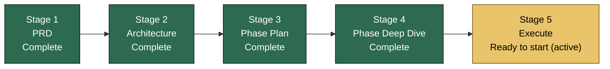
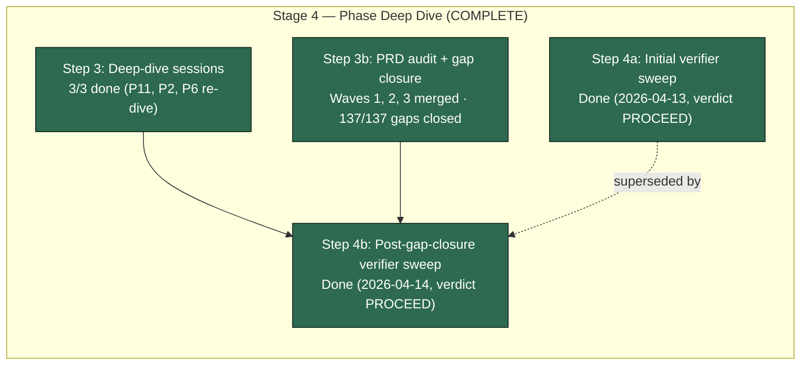
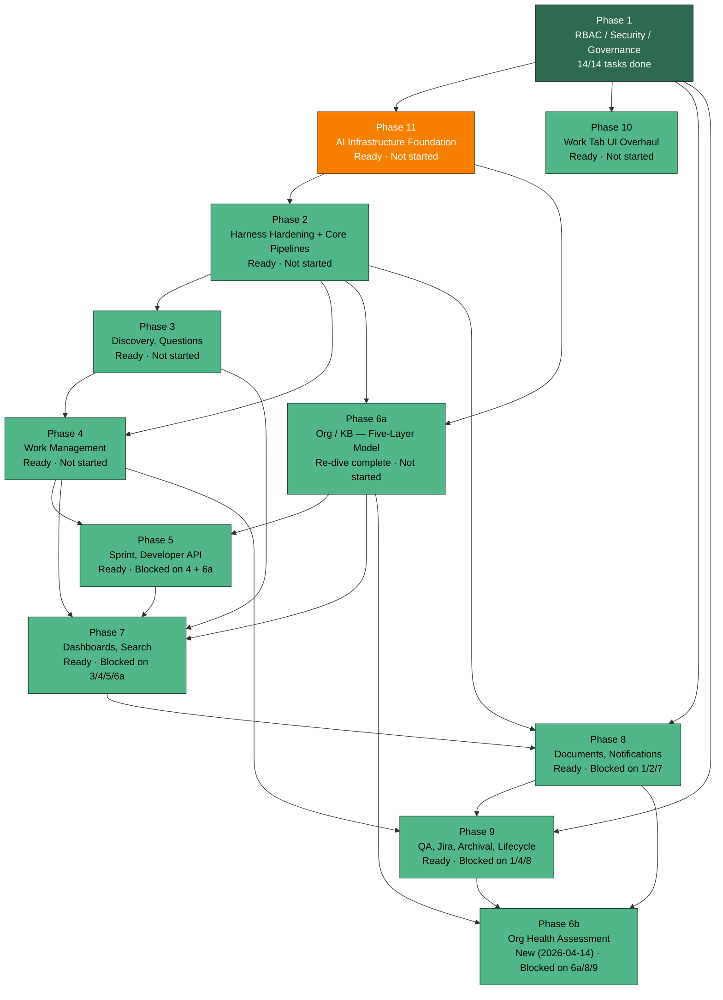
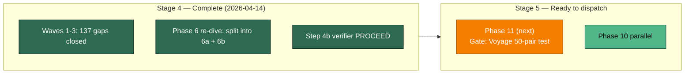

# Project State — Visual Companion

> Hand-maintained mirror of `PROJECT_STATE.md`. If anything here disagrees with `PROJECT_STATE.md`, that file wins. Update this file whenever phase status, current step, or next actions change.
>
> **Last synced:** 2026-04-14 — Phase 6 re-dive complete; split into 6a + 6b. Stage 4 COMPLETE. Stage 5 (Execute) ready to start.

---

## 1. Where we are in the overall pipeline

### Stage 4 breakdown (complete)

**Active step:** Stage 5 — Execute. Next phase to dispatch: Phase 11 (AI Infrastructure Foundation), gated by the Voyage 50-pair quality test (DECISION-03).

---

## 2. Phase dependency graph and status

**Legend:**
- Done — tasks executed and merged
- Next — next phase to dispatch
- Ready — spec + tasks locked, ready to execute when upstream unblocks

---

## 3. Current focus — Stage 5 kickoff

---

## 4. What's next (granular)

Mirrored from `PROJECT_STATE.md` → "What's next, in order". Update both files together.

1. **Phase 11 execution** (AI Infrastructure Foundation)
   - Gate: Voyage 50-pair quality test (DECISION-03)
   - Depends on: Phase 1 (done)
2. **Phase 10 execution** — dispatch in parallel with Phase 11 (no AI dep)
3. Then Phase 2 → Phase 3 + Phase 4 → Phase 6a → Phase 5 → Phase 7 → Phase 8 → Phase 9 → Phase 6b

Execution order detail in `docs/bef/02-phase-plan/PHASE_PLAN.md`.

### Quick fixes (do anytime, ~5 min each)

- None currently.

### User decisions pending

- None.

---

## 5. Bug tracker snapshot

| Metric | Value |
|---|---|
| Total bugs | 0 |
| Open | 0 |
| Active bug phase | None |

Full detail: `docs/bef/04-bugs/BUGS.md`.

---

## How to keep this file in sync

When you edit `PROJECT_STATE.md`, update these in this file:
1. **Last synced** date at the top.
2. Pipeline stage status (Section 1) if the active stage moved.
3. Phase graph classes (Section 2) if any phase status changed — edit the `:::class` suffix on the node.
4. Current focus (Section 3) if the active work shifted.
5. "What's next" list (Section 4) to match `PROJECT_STATE.md`.
